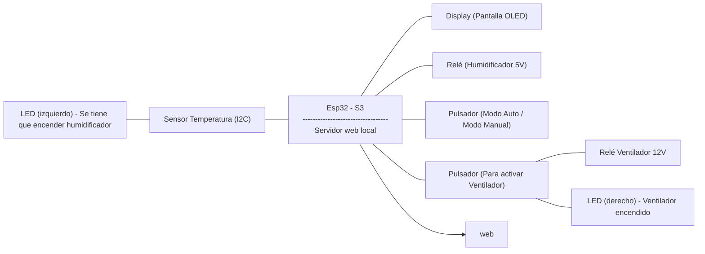

## **Proyecto: Ventilador y Humidificador inteligentes**

## **1. Componentes:**
En este projecto estamos usando un total de nueve componentes diferentes:

+ **ESP32-s3:** 
Pieza principal del montaje donde irán conectados todos los componentes.

+ **Ventilador:** 
Componente base que se activa y apaga según lo programado.

+ **Sensor AHT10:** 
Sensor I2C para captar temperatura y humedad.

+ **Pantalla OLED:** 
Pantalla donde proyectaremos la temperatura y la humedad que perciba el sensor.

+ **Relé:** 
Utilizado para poder introducir más energía para el ventilador (12V) y el humidificador (5V).

+ **Himudificador:** 
Humidificador que pondremos sobre base de agua y a partir de ondas ultrasónicas.

+ **LED's:** 
Utilizados para avisar cuando se tiene que activar el humidificador y para cuando se activa el ventilador y asi verificar que no haya errores.

+ **Pulsadores:** 
Pulsadores para activar manualmente el  el ventilador y/o el humidificador.

+ **Cables:** 
Cables para realizar todas las conexiones entre el reto de componentes.


## **2. Presupuesto:**

## **3. Diagrama de bloques:**



## **4. Montaje:**

Este montaje está diseñado para controlar un ventilador y un humidificador mediante una ESP32-S3, utilizando sensores, pantalla, pulsadores y salidas visuales. Se emplean conexiones digitales e I2C para gestionar la lectura de datos, la visualización de información y el control de actuadores a través de un relé y LEDs indicadores.

+ **Pines Relé a ESP32-s3:**

**IN1 -->** 10 

Señal digital desde la ESP32 para activar el relé.

**GND -->** GND 

Referencia de tierra compartida.

**VCC -->** 5V a un generador 

Alimentación del módulo relé (no se usa el 5V de la ESP32 para no sobrecargarla).

```
#define RELAY1_PIN 10
```

+ **Pines Sensor AHT10 a ESP32-s3:**

**SDA -->** 16

**SCL -->** 17

Líneas I2C para comunicación con el sensor.

**GND -->** GND

Tierra común.

**VIN -->** 3V3

Alimentación del sensor desde la ESP32.

```
I2C_Sensor.begin(16, 17);   // SDA = GPIO16, SCL = GPIO17 
```

+ **Pines Pantalla OLED a ESP32-s3:**

**SDA -->** 8

**SCK -->** 9

Comunicación I2C en otro bus (diferente del sensor).

**GND -->** GND

Alimentación para la pantalla.

**VDD -->** 3V3

Tierra para la pantalla.

```
Wire.begin(8, 9);   // SDA = GPIO8, SCL = GPIO9
```

+ **Pines LED activacion ventilador a ESP32-s3:**

**`+` -->** 12

**`-` -->** GND 

Se ilumina cuando el ventilador está activado.

```
#define LED1_PIN 12
```

+ **Pines LED humedad en intervalo optimo a ESP32-s3:**

**`+` -->** 13

**`-` -->** GND

Se enciende cuando la humedad está en el rango deseado.

```
#define LED2_PIN 13
```

+ **Pines Pulsador activar ventilado a ESP32-s3:**

**`+` -->** 18

**`-` -->** GND

Permite activar el ventilador de forma manual.

```
#define BUTTON1_PIN 18
```

+ **Pines Pulsador de modo manual/modo automatico a ESP32-s3:**

**`+` -->** 15

**`-` -->** GND

Cambia el estado del sistema entre control manual y automático.

```
#define BUTTON2_PIN 15 
```

+ **Pines Ventilador a Relé:**

**`+` -->** 12V a un generador

Fuente de energía del ventilador.

**`-` -->** GND

Tierra común con el sistema de potencia.

 


+ **Conexion del Humidificador:**

**`+` -->** 5 a un generador

**`-` -->** GND


Tanto el ventilador como el humidificador requieren fuentes externas para no sobrecargar la ESP32, especialmente porque operan con tensiones distintas (12V y 5V).


## **5. Funcionalidades:**
## **6. Conclusiones:**

