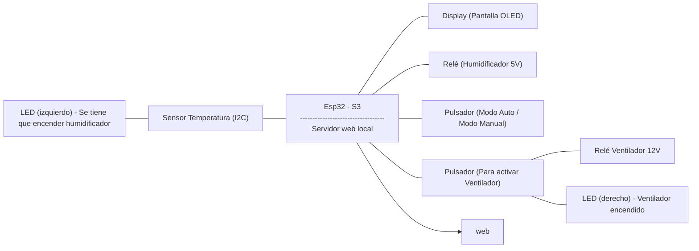

## **Proyecto: Ventilador y Humidificador inteligentes**

## **1. Componentes:**
En este projecto estamos usando un total de nueve componentes diferentes:
1. ESP32-s3: Pieza principal del montaje donde irán conectados todos los componentes.
2. Ventilador: Componente base que se activa y apaga según lo programado
3. Sensor AHT10: Sensor I2C para captar temperatura y humedad.
4. Pantalla OLED: Pantalla donde proyectaremos la temperatura y la humedad que perciba el sensor. I2C
5. Relé: Utilizado para poder introducir más energía para el ventilador (12V) y el humidificador (5V).
6. Himudificador: Humidificador que pondremos sobre base de agua y a partir de ondas ultrasónicas.
7. LED's: Utilizados para avisar cuando se tiene que activar el humidificador y para cuando se activa el ventilador y asi verificar que no haya errores.
8. Pulsadores: Pulsadores para activar manualmente el  el ventilador y/o el humidificador.
9. Cables: Cables para realizar todas las conexiones entre el reto de componentes.


## **2. Presupuesto:**

## **3. Diagrama de bloques:**



## **4. Montaje:**
## **5. Funcionalidades:**
## **6. Conclusiones:**

**Codigo main.cpp:**
```


```
