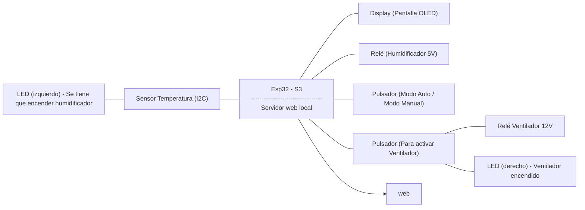

## **Proyecto: Ventilador y Humidificador inteligentes**

## **1. Componentes:**
En este projecto estamos usando un total de nueve componentes diferentes:

+ **ESP32-s3:** 
Pieza principal del montaje donde irán conectados todos los componentes.

+ **Ventilador:** 
Componente base que se activa y apaga según lo programado.

+ **Sensor AHT10:** 
Sensor I2C para captar temperatura y humedad.

+ **Pantalla OLED:** 
Pantalla donde proyectaremos la temperatura y la humedad que perciba el sensor.

+ **Relé:** 
Utilizado para poder introducir más energía para el ventilador (12V) y el humidificador (5V).

+ **Himudificador:** 
Humidificador que pondremos sobre base de agua y a partir de ondas ultrasónicas.

+ **LED's:** 
Utilizados para avisar cuando se tiene que activar el humidificador y para cuando se activa el ventilador y asi verificar que no haya errores.

+ **Pulsadores:** 
Pulsadores para activar manualmente el  el ventilador y/o el humidificador.

+ **Cables:** 
Cables para realizar todas las conexiones entre el reto de componentes.


## **2. Presupuesto:**

## **3. Diagrama de bloques:**



## **4. Montaje:**

Este montaje está diseñado para controlar un ventilador y un humidificador mediante una ESP32-S3, utilizando sensores, pantalla, pulsadores y salidas visuales. Se emplean conexiones digitales e I2C para gestionar la lectura de datos, la visualización de información y el control de actuadores a través de un relé y LEDs indicadores.

+ **Pines Relé a ESP32-s3:**
  
**COM ⟶**  12V a un generador
  
**IN1 ⟶** 10 

Señal digital desde la ESP32 para activar el relé.

**GND ⟶** GND 

Referencia de tierra compartida.

**VCC ⟶** 5V a un generador 

Alimentación del módulo relé (no se usa el 5V de la ESP32 para no sobrecargarla).

```
#define RELAY1_PIN 10
```

+ **Pines Sensor AHT10 a ESP32-s3:**

**SDA ⟶** 16

**SCL ⟶** 17

Líneas I2C para comunicación con el sensor.

**GND ⟶** GND

Tierra común.

**VIN ⟶** 3V3

Alimentación del sensor desde la ESP32.

```
I2C_Sensor.begin(16, 17);   // SDA = GPIO16, SCL = GPIO17 
```

+ **Pines Pantalla OLED a ESP32-s3:**

**SDA ⟶** 8

**SCK ⟶** 9

Comunicación I2C en otro bus (diferente del sensor).

**GND ⟶** GND

Alimentación para la pantalla.

**VDD ⟶** 3V3

Tierra para la pantalla.

```
Wire.begin(8, 9);   // SDA = GPIO8, SCL = GPIO9
```

+ **Pines LED activacion ventilador a ESP32-s3:**

**`+` ⟶** 12

**`-` ⟶** GND 

Se ilumina cuando el ventilador está activado.

```
#define LED1_PIN 12
```

+ **Pines LED humedad en intervalo optimo a ESP32-s3:**

**`+` ⟶** 13

**`-` ⟶** GND

Se enciende cuando la humedad está en el rango deseado.

```
#define LED2_PIN 13
```

+ **Pines Pulsador activar ventilado a ESP32-s3:**

**`+` ⟶** 18

**`-` ⟶** GND

Permite activar el ventilador de forma manual.

```
#define BUTTON1_PIN 18
```

+ **Pines Pulsador de modo manual/modo automatico a ESP32-s3:**

**`+` ⟶** 15

**`-` ⟶** GND

Cambia el estado del sistema entre control manual y automático.

```
#define BUTTON2_PIN 15 
```

+ **Pines Ventilador a Relé:**

**`+` ⟶** 12V a puerto NC del relé

Fuente de energía del ventilador.

**`-` ⟶** GND

Tierra común con el sistema de potencia.

 


+ **Conexion del Humidificador:**

**`+` ⟶** 5 a un generador

**`-` ⟶** GND


Tanto el ventilador como el humidificador requieren fuentes externas para no sobrecargar la ESP32, especialmente porque operan con tensiones distintas (12V y 5V).


## **5. Funcionalidades:**

En este proyecto trabajamos con un total de tres entradas y cinco salidas físicas, junto con dos modos de funcionamiento: manual y automático. 

+ **Entradas físicas:**

Disponemos de dos pulsadores y un sensor AHT10 que mide la temperatura y la humedad del entorno.

+ **Pulsador de control del ventilador:**

Este pulsador funciona únicamente en modo manual. Cada vez que se pulsa, alterna el estado del relé, lo que provoca que el ventilador se encienda o apague. Este comportamiento se basa en un sistema tipo "Switch ON / Switch OFF", donde el estado se mantiene hasta que se vuelva a pulsar el botón.
 
+ **Pulsador de selección de modo:**

Este segundo botón permite cambiar entre modo manual y modo automático.

En modo automático, el sistema usa los datos del sensor de temperatura para decidir el encendido o apagado del ventilador.

Se ha configurado un rango de histéresis:

-Si la temperatura sube de 30 °C, el ventilador se enciende automáticamente.

-Si baja de 28 °C, el ventilador se apaga automáticamente.

-Entre 28 °C y 30 °C, el ventilador mantiene su estado anterior para evitar ciclos rápidos de encendido y apagado.
 
+ **LED de control del ventilador:**

Cada vez que el ventilador se enciende, también lo hace un LED asociado.
Esto sirve como verificación:

-Si el LED se enciende pero el ventilador no, hay un fallo en el relé o en el hardware del ventilador.

-Si ni el LED ni el ventilador responden, el error es probablemente de programación. Este sistema de comprobación ha facilitado la detección rápida de fallos.

+ **Pantalla OLED:**

En la pantalla mostramos en tiempo real:

-Temperatura y humedad actuales.

-Estado del ventilador (ENCENDIDO/APAGADO). 

-Modo del sistema (MANUAL/AUTOMÁTICO).

-Indicaciones sobre el humidificador.
 
+ **Control del humidificador:**

El humidificador no se puede controlar directamente desde la ESP32-S3, ya que cuenta con una placa base independiente.
Por ello, el sistema emite mensajes en pantalla guiando al usuario:

-Si la humedad baja de un cierto umbral, se recomienda encender el humidificador manualmente.

-Si la humedad es adecuada, se muestra el mensaje de "humedad ideal" y se enciende un segundo LED como indicador visual.

-Si la humedad es excesiva, se pide al usuario que apague el humidificador.

 
+ **Interfaz web:**

Se ha desarrollado una página web que muestra los mismos datos que la pantalla OLED, además de:

-Gráficas en tiempo real para temperatura y humedad.

-Botón para alternar entre modo manual y automático.

-En modo manual, aparece un segundo botón que permite encender o apagar el ventilador desde la web.

```
void handleRoot() {
  String html = R"rawliteral(
    <!DOCTYPE html>
    <html>
    <head>
      <title>Control Ventilador y Humidificador</title>
      <style>
        body { font-family: Arial; margin: 20px; background: #f0f0f0; }
        .status { margin-top: 10px; }
        button { padding:10px 20px; font-size:16px; margin:5px; }
        canvas { background: white; border: 1px solid #ccc; margin-top:10px; }
      </style>
    </head>
    <body>
      <h2>Estado Sistema</h2>
      <p>Temperatura: <span id="temp">--</span> °C</p>
      <p>Humedad: <span id="hum">--</span> %</p>
      <p>Ventilador: <span id="vent">--</span></p>
      <p>Modo: <span id="modo">--</span></p>
      <p>Humidificador: <span id="humstate">--</span></p>
      <button id="toggleModo">Cambiar Modo</button>
      <button id="toggleVent" style="display:none;">Encender/Apagar Ventilador</button>

      <canvas id="chartTemp" width="400" height="150"></canvas>
      <canvas id="chartHum" width="400" height="150"></canvas>

      <script src="https://cdn.jsdelivr.net/npm/chart.js"></script>
      <script>
        const tempEl = document.getElementById('temp');
        const humEl = document.getElementById('hum');
        const ventEl = document.getElementById('vent');
        const modoEl = document.getElementById('modo');
        const humStateEl = document.getElementById('humstate');
        const toggleModoBtn = document.getElementById('toggleModo');
        const toggleVentBtn = document.getElementById('toggleVent');

        toggleModoBtn.onclick = () => {
          fetch('/toggleModo').then(updateStatus);
        };

        toggleVentBtn.onclick = () => {
          fetch('/toggleVent').then(updateStatus);
        };

        let tempChart, humChart;
        let tempData = [];
        let humData = [];
        let labels = [];

        function setupCharts() {
          const ctxTemp = document.getElementById('chartTemp').getContext('2d');
          const ctxHum = document.getElementById('chartHum').getContext('2d');

          tempChart = new Chart(ctxTemp, {
            type: 'line',
            data: {
              labels: labels,
              datasets: [{
                label: 'Temperatura (°C)',
                data: tempData,
                borderColor: 'red',
                fill: false,
              }]
            },
            options: {
              animation: false,
              scales: { y: { min: 0, max: 50 } }
            }
          });

          humChart = new Chart(ctxHum, {
            type: 'line',
            data: {
              labels: labels,
              datasets: [{
                label: 'Humedad (%)',
                data: humData,
                borderColor: 'blue',
                fill: false,
              }]
            },
            options: {
              animation: false,
              scales: { y: { min: 0, max: 100 } }
            }
          });
        }

        function updateStatus() {
          fetch('/status')
            .then(response => response.json())
            .then(data => {
              tempEl.textContent = data.temperatura.toFixed(1);
              humEl.textContent = data.humedad.toFixed(1);
              ventEl.textContent = data.ventilador ? 'ENCENDIDO' : 'APAGADO';
              modoEl.textContent = data.modoAutomatico ? 'AUTOMATICO' : 'MANUAL';
              humStateEl.textContent = data.estadoHumidificador;

              if (data.modoAutomatico) {
                toggleVentBtn.style.display = 'none';
              } else {
                toggleVentBtn.style.display = 'inline-block';
              }

              // Actualizar arrays para graficos
              const now = new Date();
              const label = now.getHours() + ":" + now.getMinutes() + ":" + now.getSeconds();
              labels.push(label);
              if (labels.length > 30) labels.shift();

              tempData.push(data.temperatura);
              if (tempData.length > 30) tempData.shift();

              humData.push(data.humedad);
              if (humData.length > 30) humData.shift();

              tempChart.update();
              humChart.update();
            });
        }

        window.onload = () => {
          setupCharts();
          updateStatus();
          setInterval(updateStatus, 2000);
        };
      </script>
    </body>
    </html>
  )rawliteral";

  server.send(200, "text/html", html);
}

void handleStatus() {
  String json = "{";
  json += "\"temperatura\":" + String(temperaturaGlobal, 1) + ",";
  json += "\"humedad\":" + String(humedadGlobal, 1) + ",";
  json += "\"ventilador\":" + String(ventiladorGlobal ? "true" : "false") + ",";
  json += "\"modoAutomatico\":" + String(modoAutomaticoGlobal ? "true" : "false") + ",";
  json += "\"estadoHumidificador\":\"" + estadoHumidificadorGlobal + "\"";
  json += "}";

  server.send(200, "application/json", json);
}

void handleToggleModo() {
  modoAutomatico = !modoAutomatico;
  server.send(200, "text/plain", "OK");
}

void handleToggleVent() {
  if (!modoAutomatico) {
    ventiladorActivo = !ventiladorActivo;
  }
  server.send(200, "text/plain", "OK");
}
```
**1. `handleRoot()` – Página principal**

Esta función genera la página web principal (HTML) y la envía al navegador. La página incluye:

+ **Información en tiempo real:**

-Temperatura

-Humedad

-Estado del ventilador: ENCENDIDO / APAGADO

-Modo del sistema: MANUAL / AUTOMÁTICO

-Estado del humidificador

+ **Botones interactivos:**

-Cambiar Modo → Alterna entre modo MANUAL y AUTOMÁTICO

-Encender/Apagar Ventilador → Solo visible en modo MANUAL

+ **Gráficas en tiempo real (usando Chart.js):**

-Temperatura (°C)

-Humedad (%)


**2. Lógica JavaScript (en el navegador)**

La lógica implementada en JavaScript permite la interacción dinámica y visualización en tiempo real:

+ **Actualización periódica:**

Cada 2 segundos, se llama a la ruta `/status` para:

-Actualizar los valores mostrados

-Añadir nuevos puntos a las gráficas

+ **Función de botones:**

-`fetch('/toggleModo')` → Cambia entre modo **MANUAL** y **AUTOMÁTICO**

-`fetch('/toggleVent')` → En **modo MANUAL**, alterna el estado del ventilador

+ **Gráficas:**

-Se mantiene un historial de los últimos 30 datos.
  
-Las gráficas se actualizan dinámicamente sin recargar la página.
  

**3. Rutas del servidor (ESP32-S3)**

Estas rutas son gestionadas por el servidor web integrado en el ESP32-S3:

**`handleStatus()`**

Devuelve un JSON con los valores actuales de temperatura, humedad, modo, etc.

**`handleStatus()`**

Cambia entre modo manual y automático (modoAutomatico = !modoAutomatico).

**`handleStatus()`**

En modo manual, cambia el estado del ventilador (ventiladorActivo = !ventiladorActivo).

## **6. Conclusiones:**

